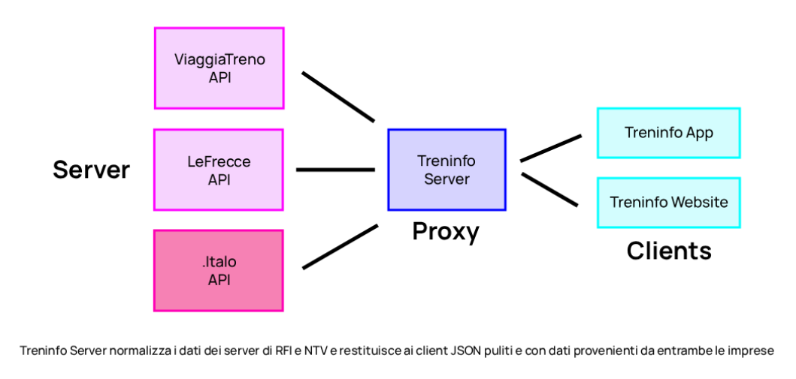

# Treninfo - App e Server

Server proxy che normalizza i dati dei server di RFI (ViaggiaTreno e LeFrecce) e NTV (.italo) in JSON annidati e sistemati pronti per client web/app.

TODO: Integrare le soluzioni viaggio di .italo.

Base URL: `https://treninfo.netlify.app/api`



Nota:
- `/stations/autocomplete` e `/lefrecce/autocomplete` usano solo `stazioni.json` locale.
- `/viaggiatreno/autocomplete` interroga ViaggiaTreno e normalizza i nomi.
- Se `lefrecceId` è `null`, la stazione non è supportata da LeFrecce.
- Se `italoId` è `null`, la stazione non è interrogabile per tabelloni Italo (partenze/arrivi).

## Sito web
- Nuova landing page con tema chiaro/scuro, hero, sezione schermate e sezione "Server & Test".
- Il bottone "Health" punta a `/api/health`.
- `test-chiamate.html` è disponibile solo in locale (in produzione è nascosto via redirect 404). Vedi in `netlify.toml`

## Formato stazioni.json

Questo è il nuovo file dal quale i nomi della stazioni vengono uniformati per tutti i servizi. Avete mai notato che in alcune app nelle soluzioni di viaggio i nomi sono scritti canonici (es: Firenze S. M. Novella) mentre nella ricerca treno/stazione in maiuscolo e/o con nomi diversi (es: FIRENZE S.M.N.). Questo è dovuto al fatto che ViaggiaTreno e LeFrecce usano 2 database diversi per i nomi delle stazioni e codici completamente diversi. Idem per .italo.

Campi principali (ogni stazione):
- `nome`: nome pubblico stazione normalizzato.
- `viaggiatrenoId`: codice RFI (es. `S01700`). Può essere `null` per voci aggregate.
- `id`: **nuovo** codice alternativo quando manca `viaggiatrenoId` (es. `LF830005999` per "Tutte le stazioni"), stazioni presenti solo per le soluzioni di viaggio.
- `lefrecceId`: ID stazione LeFrecce (numero) o `null`.
- `italoId`: codice stazione Italo (stringa) usato per tabelloni Italo, o `null`.
- `regionId`, `lat`, `lon`: regione e coordinate.
- `disuso`: indica se la seguente stazione è attualmente dismessa al servizio passeggeri.


## Classificazione treni
- `tipoTreno.compagnia`: `TI` (Trenitalia), `TN` (Trenord), `TTX` (Trenitalia TPer), `NTV` (Italo), `OBB`.
- Codici cliente compagnie/sottocompagnie:
  - `1` → Trenitalia AV sigla: `TI`
  - `2` → Trenitalia Regionali sigla: `TI`
  - `4` → Trenitalia Intercity sigla: `TI`
  - `18` → Trenitalia TPer sigla: `TTX`
  - `63` → Trenord sigla: `TN`
  - `64` → OBB sigla: `OBB` so una sega

- Tipi di treni
  - REG: Regionali, sigla semplice `REG`, percorrono linee convenzionali e AV fino a 160 km/h. Solitamente convogli Pop, Rock, Vivalto, Jazz o Minuetto variante Diesel e le storiche carrozze MDVC e MDVE. Per le carrozze motrici solite le E 464 di Bombardier.

  - FR: Frecciarossa, unito con la categoria Alta-Velocità, `FR AV`. Viaggia il linee AV fino a 250 km/h per ETR 500/600/700 o 300 km/h in caso di ETR 1000.

  - FA: Frecciargento, unito con la categoria Alta-Velocità, `FA AV`. Viaggia in linee AV e convenzionali, solitamente vengono sfruttate quest'ultime assieme ai convogli "Pendolino" con assetto variabile attivo per sfruttare al massimo la velocità fra le curve. Velocità massima generale 250 km/h, con convogli ETR 600 e ETR 485

  - FB: Frecciabianca, `FB`. Viaggi medio/lunghi per linee convenzionali, operati con i soliti ETR 465 con lo stesso principio dei Frecciargento, assetto attivo e velocità ottimale fra le curve di un tracciato ottocentesco. Velocità commerciale massima di 200 km/h.

  - IC/ICN: InterCity giorno (un tempo sun) e InterCity notte (un tempo night), `IC/ICN`.
  Questi ultimi fanno tratte letteralmente infinite da nord a sud Italia continuamente. I convogli e le carrozze soliti sono le UIC-X abbinate a locomotive E 414, E 403 e E 464 con veloctà rispettive di 200, 180 e 160 km/h. 

  - EC/EN: riconosciuti come `EC` (EuroCity) e `EN` (EuroNight), privi di AV nel numero del treno, ma con stesso codice cliente di Frecciarossa e Frecciargento. Categoria analoga a quella degli InterCity, a volte operata con materiale rotabile estero.

  - MET: riconosciuto come `MET` (metropolitana/circumvesuviana).

  - ES: EuroStar ricompare dopo 15 anni dalla rimozione del brand, rimasto per treni AV di percorrenza notturna per servizio sconosciuto, riconosciuti come `ES/E*`.

  - Italo: riconosciuto come `ITA` (sigla `ITA AV`). Viaggiano esclusivamente su linee AV fino a 25 kV in AC, come anche i Frecciarossa, sono chiaramente compatibili con la più bassa tensione d'esercizio per le linee convezionali di 3 kV in DC. Operati con AGV 575 di Alstom con velocità massima di 330 km/h e ETR 675 a 250 km/h

Nota: 

i treni in servizio Frecciabianca `FB` e i treni in servizio Frecciargento `FA AV` stanno gradualmente venendo soppressi per passaggio rispettivamente a `IC` e `FR AV`. 

## Endpoints

### GET /health
Request:
- Nessun parametro.

Response (esempio):
```json
{
  "ok": true,
  "stationDb": {
    "loaded": true,
    "count": 3253
  }
}
```

### GET /stations/autocomplete
Request (query string):
- `query` (obbligatorio, min 2 caratteri)
- `limit` (opzionale, max 50)
- `includeIds` (opzionale, `1` per oggetti con id)

Response (esempio, includeIds=0):
```json
{
  "ok": true,
  "data": ["Milano Centrale", "Milano Rogoredo"]
}
```

Response (esempio, includeIds=1):
```json
{
  "ok": true,
  "data": [
    {
      "name": "Milano Centrale",
      "stationCode": "S01700",
      "lefrecceId": 830001700,
      "italoCode": "MC_"
    }
  ]
}
```

### GET /lefrecce/autocomplete
Autocomplete locale filtrato sulle stazioni con `lefrecceId`.

Request (query string):
- `query` (obbligatorio, min 2 caratteri)
- `limit` (opzionale, max 50)
- `includeIds` (opzionale, `1` per oggetti con id)

Response (esempio, includeIds=1):
```json
{
  "ok": true,
  "data": [
    {
      "stazione": "Roma (Tutte le stazioni)",
      "multistation": true,
      "lefrecceId": 830008349,
      "stationCode": "S08409"
    }
  ]
}
```

Nota: anche con `includeIds=0`, la risposta è un array di oggetti (con `stazione` e `multistation`).

### GET /viaggiatreno/autocomplete
Autocomplete online (RFI).

Request (query string):
- `query` (obbligatorio, min 2 caratteri)

Response (esempio):
```json
{
  "ok": true,
  "data": ["Milano Centrale", "Milano Rogoredo"]
}
```

### GET /stations/info
Request (query string):
- `stationName` oppure `stationCode`

Response (esempio):
```json
{
  "ok": true,
  "stazione": "Roma Termini",
  "latitudine": 41.900636,
  "longitudine": 12.502026,
  "regione": "5"
}
```

### GET /stations/departures
### GET /stations/arrivals
Request (query string):
- `stationName` oppure `stationCode`
- `when` (opzionale, default `now`)
- `raw=1` (opzionale, solo se `ENABLE_RAW_UPSTREAM=1`)

Note:
- Se la stazione ha `italoId` nel DB locale e `when` è `now`/oggi, i treni Italo vengono uniti a quelli RFI.

Response (esempio):
```json
{
  "ok": true,
  "stazione": "Milano Centrale",
  "data": "2026-01-27T10:00:00.000Z",
  "treni": [
    {
      "numeroTreno": "9510",
      "origine": "Milano Centrale",
      "destinazione": "Roma Termini",
      "orarioPartenza": 1769510400000,
      "orarioPartenzaLeggibile": "10:00",
      "ritardo": 0,
      "binarioProgrammato": "7",
      "binarioEffettivo": "7",
      "arrivato": false,
      "circolante": true,
      "tipoTreno": {"sigla": "FR AV", "nome": "Frecciarossa", "compagnia": "TI"}
    }
  ]
}
```

### GET /trains/status
Stato treno normalizzato (RFI + Italo quando disponibile).

Request (query string):
- `trainNumber` (o `numeroTreno`)
- opzionali: `originName`, `originCode`, `date`/`data`/`serviceDate` (`YYYY-MM-DD`), `timestampRiferimento`/`epochMs`, `technical`/`id`, `choice`
- `debug=1` (solo se `ENABLE_DEBUG_RAW=1`)

Cache e deduplica:
- Le risposte vengono cache per breve tempo per ridurre le chiamate upstream quando molti utenti chiedono lo stesso treno.
- La ricerca `cercaNumeroTreno` e gli snapshot `andamentoTreno` sono cache per evitare burst verso ViaggiaTreno.
- Per Italo, l'ultimo stato valido viene conservato anche dopo la fine corsa (quando l'API Italo smette di rispondere).
Nota: la cache è in-memory (funzioni serverless), quindi è efficace finché la funzione resta "warm".

Note:
- `ultimo rilevamento`: il luogo è riportato **pari pari** come fornito da RFI, senza mapping.
- `binari`: se ViaggiaTreno non fornisce il binario (o lo restituisce `0`), il valore è `null`.
- Italo: quando disponibile, i nomi stazione vengono risolti tramite **codice Italo** nel DB locale; altrimenti rimane il nome raw.
- `statoServizio`: stato servizio RFI derivato da `tipoTreno`/`provvedimento` (es. Regolare, Deviato, Parzialmente soppresso, Soppresso).
- `statoServizioRaw`: valore grezzo normalizzato (es. `deviato`, `parzialmente_soppresso`).
- `statoServizioRfi`: dettaglio tecnico `{ tipoTreno, provvedimento }` quando disponibile.
- `corrispondenza`: indica se sono stati trovati dati RFI e/o Italo per lo stesso numero.

Selezione corse (quando il numero è ambiguo):
- `needsSelection=true` con `selectionType=origin` e `choices` per scegliere l'origine.
- Se l'origine è univoca ma ci sono più giorni: `selectionType=date` con `dateDisponibili` (array di `{ data, timestamp }`) e `choices`.

Response (esempio sintetico):
```json
{
  "ok": true,
  "dataRiferimento": "27/01/2026",
  "dateDisponibili": ["27/01/2026"],
  "compagnia": "rfi",
  "numeroTreno": 9510,
  "tipoTreno": {"categoria": "FR AV", "nomeCat": "Frecciarossa", "compagnia": "TI"},
  "tratta": {
    "stazionePartenzaZero": "Milano Centrale",
    "orarioPartenzaZero": "10:00",
    "stazioneArrivoZero": "Roma Termini",
    "orarioArrivoZero": "13:59"
  },
  "statoTreno": {
    "deltaTempo": 0,
    "stato": "In viaggio",
    "stazioneCorrente": null,
    "statoServizio": "Regolare",
    "statoServizioRaw": "regolare",
    "statoServizioRfi": {"tipoTreno": "FR", "provvedimento": "REGOLARE"}
  },
  "fermate": {"totali": 8, "fermate": []},
  "corrispondenza": {"rfi": {"trovato": true}, "italo": {"trovato": false}}
}
```

### GET /italo/trains/status
Come `/trains/status` ma solo Italo.

Request (query string):
- `trainNumber` (o `numeroTreno`)

Response: stesso schema di `/trains/status`.

Nota: supporta `raw=1` solo se `ENABLE_RAW_UPSTREAM=1`.

### GET /solutions
Soluzioni viaggio LeFrecce.

Request (query string):
- `fromLefrecceId` / `toLefrecceId` (consigliati)
- alternative: `departureLocationId` / `arrivalLocationId`
- fallback: `fromStationCode` / `toStationCode` oppure `fromName` / `toName` (se presenti nel DB locale)
- `date` (obbligatorio, `YYYY-MM-DD`)
- `time` (opzionale, `HH:mm`)
- opzionali: `adults`, `children`, `frecceOnly`, `regionalOnly`, `intercityOnly`, `tourismOnly`, `noChanges`, `order`, `offset`, `limit`, `bestFare`, `bikeFilter`

Response (esempio):
```json
{
  "ok": true,
  "idRicerca": "830001700-830008409-one_way-2026-01-27T10:00:00.000---...",
  "stazioni": {
    "from": "Milano Centrale",
    "to": "Roma Termini"
  },
  "soluzioni": [
    {
      "durata": 219,
      "dataPartenza": "2026-01-27",
      "partenza": "10:10",
      "dataArrivo": "2026-01-27",
      "arrivo": "13:49",
      "cambi": 0,
      "prezzo": {"valuta": "EUR", "importo": 74.9, "indicativo": false},
      "treni": [
        {
          "numeroTreno": "9510",
          "tipoTreno": {"sigla": "FR AV", "nome": "Frecciarossa"},
          "da": "Milano Centrale",
          "a": "Roma Termini",
          "dataPartenza": "2026-01-27",
          "orarioPartenza": "10:10",
          "dataArrivo": "2026-01-27",
          "orarioArrivo": "13:49"
        }
      ]
    }
  ]
}
```

### GET /news
Infomobilità ViaggiaTreno in formato JSON (notizie e lavori/perturbazioni).

Request (query string):
- `works` oppure `lavori` (opzionale, `1`/`true` per info lavori e perturbazioni; default `false`)

Response (esempio):
```json
{
  "ok": true,
  "works": false,
  "data": [
    {
      "title": "CIRCOLAZIONE REGOLARE SULLA RETE ALTA VELOCITÀ",
      "date": "03.02.2026",
      "text": "In questo momento la circolazione si svolge regolarmente sull'intera rete Alta Velocità.\nEventuali ritardi registrati si riferiscono a precedenti inconvenienti già risolti.\nREGULAR TRAFFIC ON THE HIGH-SPEED RAILWAY NETWORK\nAt the moment, the railway traffic is regular on the whole High-Speed network.",
      "inEvidenza": true
    }
  ]
}
```

Note sui campi di `data`:
- `title`: titolo della notizia
- `date`: data in formato `DD.MM.YYYY` (come fornita da ViaggiaTreno)
- `text`: testo pulito dall'HTML, con paragrafi separati da `\n`; è un riassunto compatto (max 3 righe) e può includere più lingue
- `inEvidenza`: `true` se la notizia è marcata "in evidenza" nel feed ViaggiaTreno

Response errore (esempio):
```json
{
  "ok": false,
  "error": "We are sorry. An error has occurred."
}
```

Nota: `raw=1` disponibile solo con `ENABLE_RAW_UPSTREAM=1`.

### GET /viaggiatreno/station-board
Tabellone stazione (JSON, solo RFI).

Request (query string):
- `stationName` oppure `stationCode`
- `raw=1` (opzionale, solo se `ENABLE_RAW_UPSTREAM=1`)

Response (esempio):
```json
{
  "ok": true,
  "stazione": "Milano Centrale",
  "data": {
    "departures": [],
    "arrivals": []
  }
}
```

### GET /stations/board
Tabellone stazione HTML raw (ViaggiaTreno).

Request (query string):
- `stationCode` (obbligatorio)

## Esempi rapidi

```bash
curl "https://treninfo.netlify.app/api/health"
curl "https://treninfo.netlify.app/api/stations/autocomplete?query=roma&includeIds=1"
curl "https://treninfo.netlify.app/api/lefrecce/autocomplete?query=roma&includeIds=1"
curl "https://treninfo.netlify.app/api/solutions?fromLefrecceId=830001700&toLefrecceId=830008409&date=2026-01-27&time=10:00"
```
## Sicurezza e performance
- Rate limiting per IP (in-memory): default 120 req/min standard, 30 req/min per endpoint pesanti (`/trains/status`, `/italo/trains/status`, `/solutions`).
- Cache in-memory con TTL brevi per ridurre chiamate upstream (news, tabelloni, treni, Italo).
- Header `Cache-Control` per caching CDN (quando disponibile).
- Security headers base per API JSON.
- In serverless la cache è volatile: funziona finché la funzione resta "warm".

Variabili ambiente principali:
- `CORS_ORIGINS` = lista separata da virgole (se vuota accetta tutti)
- `FETCH_TIMEOUT_MS` = timeout fetch upstream (default 12000)
- `CACHE_TTL_MS` = TTL cache generica (default 5 min)
- `CACHE_MAX_ENTRIES` = max entry cache (default 2000)
- `TRUST_PROXY` = 1 per usare `X-Forwarded-For` nel rate limiting (default 0)
- `RATE_LIMIT_ENABLED` = 1 (default), `RATE_LIMIT_WINDOW_MS` = 60000, `RATE_LIMIT_MAX` = 120, `RATE_LIMIT_HEAVY_MAX` = 30, `RATE_LIMIT_MAX_ENTRIES` = 10000
- `SECURITY_HEADERS_ENABLED` = 1 (default), `EXPOSE_ERRORS` = 1 per esporre i messaggi upstream
- `APP_TIME_ZONE` = timezone di riferimento (default `Europe/Rome`)
- `ENABLE_RAW_UPSTREAM` = 1 per abilitare `raw=1` (debug risposte upstream)
- `ENABLE_DEBUG_RAW` = 1 per abilitare `debug=1` su `/trains/status`
- `NEWS_TTL_MS` = 60000, `STATION_BOARD_TTL_MS` = 30000, `STATION_DEPARTURES_TTL_MS` = 30000, `STATION_ARRIVALS_TTL_MS` = 30000, `ITALO_BOARD_TTL_MS` = 30000
- `TRAIN_STATUS_TTL_MS` = 30000, `TRAIN_SEARCH_TTL_MS` = 600000, `TRAIN_SNAPSHOT_TTL_MS` = 30000, `ITALO_STATUS_TTL_MS` = 30000, `ITALO_LAST_KNOWN_TTL_MS` = 43200000
- `ITALO_SOFT_TIMEOUT_MS` = 200 (non blocca la risposta RFI se Italo è lento)

### Scritto e programmato da Cristian Ceni.


Si ringrazia Aurora per la realizzazione di questo logo con la bandiera.